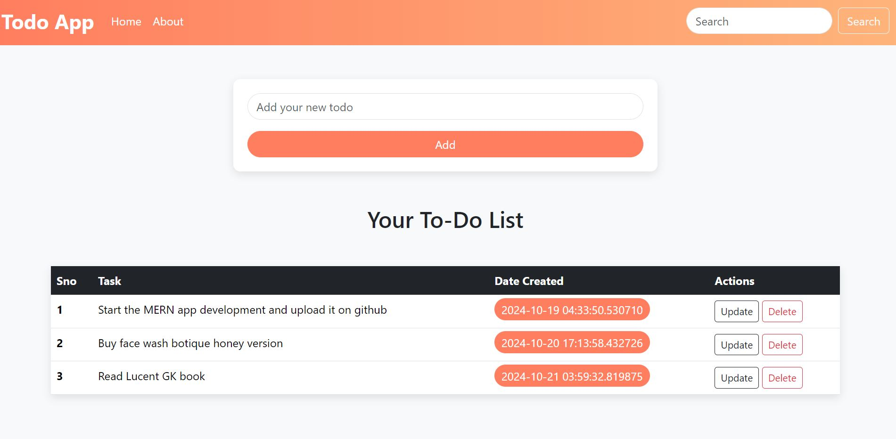
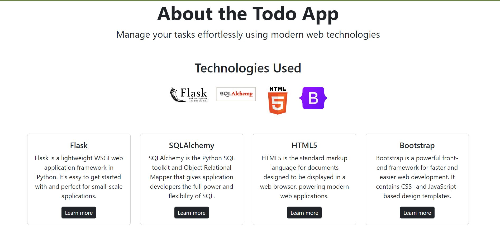

<h1>Todo App</h1>
<a href="https://todo-app-uxfn.onrender.com">Live Website</a>

  
<h2>Screenshots</h2>
  
  

<h2>Features</h2>
  <ul>
    <li><b>Task Management: </b>We can Add, Update and Delete the list.</li>
    <li><b>User friendly Interface: </b>Intuitive and Responsive design for seamless user experience.</li>
    <li><b>Persistent Storage: </b>All tasks are saved in a database for persistent storage.
    <li><b>Real-time Updates: </b>Tasks are updated in real-time without the need to refresh the page.</li>
    
  </ul>

  <h2>Installation</h2>
  To run this project locally 
  <ul>
    <li>Clone the repository: git clone https://github.com/punekarshailesh/Todo-App.git</li>
<li>Navigate to directory: cd Todo-App </li>
<li>Dependencies installation: pip install -r requirements.txt</li>
<li>Environment variables setup: 
  DATABASE_URL=your_database_url
  SECRET_KEY=your_secret_key
</li>
<li>
  Run the application:
    python app.py
</li>
    
  </ul>
  

